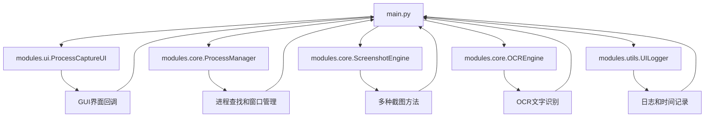

# 项目文件结构

## 📁 整体目录结构

```
d:\project\pojie\ocr\
├── main.py                     # 主程序入口（推荐使用）
├── process_capture.py          # 兼容性入口（会提示升级）
├── capture.py                  # 独立截图工具（g键触发）
├── requirements.txt            # 依赖库清单
├── README.md                   # 项目说明文档
├── INSTALL.md                  # 安装指南
├── PROJECT_STRUCTURE.md        # 项目结构文档（当前文件）
├── check_dependencies.py       # 依赖检查脚本
├── start_process_capture.bat   # Windows启动脚本
├── start_process_capture.sh    # Linux/macOS启动脚本
├── process_capture_legacy.py   # 兼容性备份文件
├── screenshots/                # 截图保存目录
└── modules/                    # 模块化代码目录
    ├── __init__.py             # 模块包初始化文件
    ├── core/                   # 核心功能模块
    │   ├── __init__.py         # 核心模块包初始化
    │   ├── process_manager.py  # 进程管理模块
    │   ├── screenshot_engine.py # 截图引擎模块
    │   └── ocr_engine.py       # OCR识别引擎模块
    ├── ui/                     # 用户界面模块
    │   ├── __init__.py         # UI模块包初始化
    │   └── process_capture_ui.py # GUI界面模块
    └── utils/                  # 工具模块
        ├── __init__.py         # 工具模块包初始化
        └── ui_logger.py        # 日志工具模块
```

## 🚀 启动方式

### 1. 推荐方式（新架构）
```bash
python main.py
```

### 2. 兼容性方式
```bash
python process_capture.py  # 会提示升级到新版本
```

### 3. 独立截图工具
```bash
python capture.py  # g键触发区域截图，Shift+g键默认截图
```

## 📦 模块说明

### 🎯 核心模块 (modules/core/)

#### ProcessManager (process_manager.py)
- **功能**: 进程管理和窗口操作
- **主要类**: `ProcessManager`
- **职责**:
  - 查找匹配进程
  - 窗口激活和管理
  - Windows API调用
  - 窗口状态检查

#### ScreenshotEngine (screenshot_engine.py) 
- **功能**: 多种截图方法实现
- **主要类**: `ScreenshotEngine`
- **职责**:
  - 标准截图方法
  - 窗口句柄截图
  - 自动选择截图方法
  - 黑色图像检测

#### OCREngine (ocr_engine.py)
- **功能**: OCR文字识别和处理
- **主要类**: `OCREngine`
- **职责**:
  - PaddleOCR引擎封装
  - 图像识别处理
  - 置信度过滤
  - 结果格式化

### 🎨 界面模块 (modules/ui/)

#### ProcessCaptureUI (process_capture_ui.py)
- **功能**: GUI界面和用户交互
- **主要类**: `ProcessCaptureUI`
- **职责**:
  - tkinter界面构建
  - 用户交互处理
  - 回调函数管理
  - 界面状态更新

### 🛠 工具模块 (modules/utils/)

#### UILogger (ui_logger.py)
- **功能**: 日志记录和时间统计
- **主要类**: `UILogger`, `TimingRecorder`
- **职责**:
  - 线程安全日志输出
  - 性能时间记录
  - 日志级别管理
  - 时间统计分析

## 🔄 模块间依赖关系



## ⚙️ 导入方式

### 在主程序中导入
```python
# main.py 中的导入方式
from modules.ui import ProcessCaptureUI
from modules.core import ProcessManager, ScreenshotEngine, OCREngine
from modules.utils import UILogger, TimingRecorder
```

### 在其他模块中导入
```python
# 从包根目录导入
from modules.core import OCREngine, ProcessManager
from modules.ui import ProcessCaptureUI
from modules.utils import UILogger

# 或者直接导入
from modules.core.ocr_engine import OCREngine
from modules.core.process_manager import ProcessManager
```

## 🎯 设计优势

### 1. 模块化设计
- ✅ 功能分离，职责明确
- ✅ 便于维护和扩展
- ✅ 代码复用性高
- ✅ 单元测试友好

### 2. 包结构清晰
- 📁 **core**: 核心业务逻辑
- 📁 **ui**: 用户界面相关
- 📁 **utils**: 通用工具函数

### 3. 向后兼容
- 🔄 保留原有入口文件
- 🔔 智能提示用户升级
- 📋 迁移引导说明

### 4. 易于扩展
- ➕ 新功能模块可独立开发
- 🔧 接口设计规范统一
- 📊 便于集成新的AI能力

## 🚧 未来扩展方向

1. **AI增强功能**
   - modules/ai/: AI相关模块
   - 智能图像预处理
   - 多语言识别支持

2. **插件系统**
   - modules/plugins/: 插件模块
   - 自定义截图处理器
   - 第三方OCR引擎集成

3. **配置管理**
   - modules/config/: 配置模块
   - 用户偏好设置
   - 主题和样式管理

4. **网络功能**
   - modules/network/: 网络模块
   - 云端OCR服务
   - 结果同步和分享